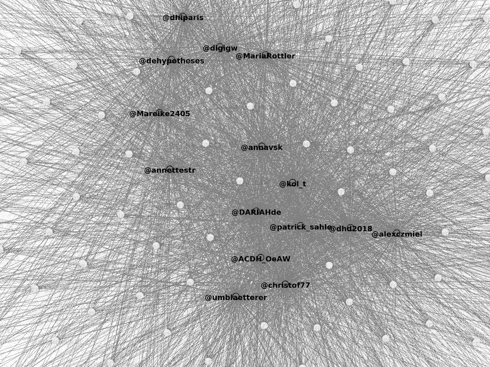
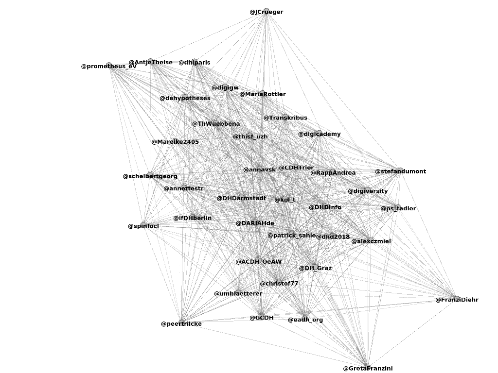
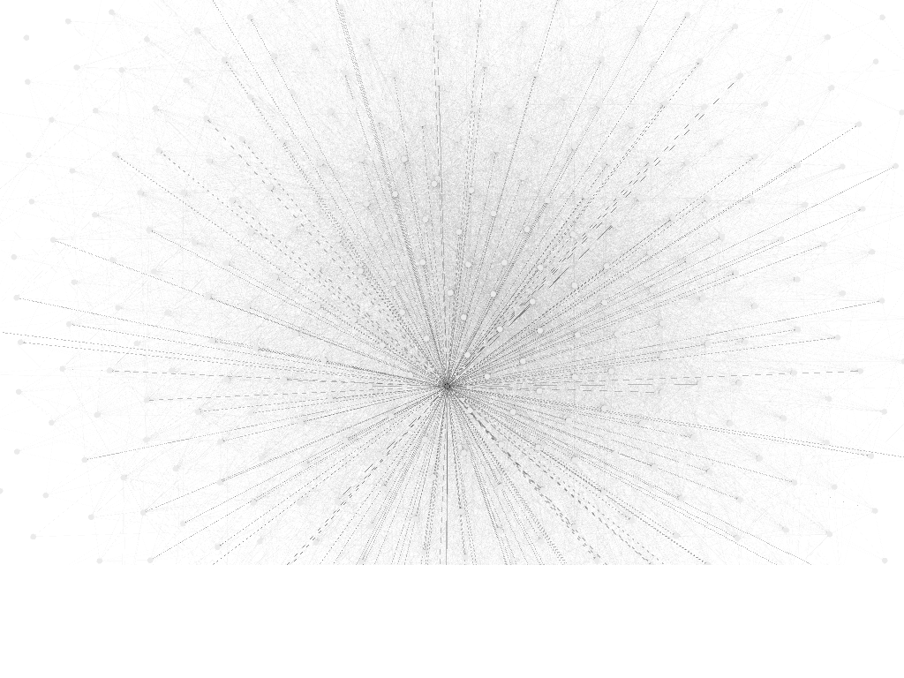

% Notizbuch Netzwerkexploration #dhd2018
% Claus-Michael Schlesinger
% 5.3.2018

## Kurzbeschreibung

In diesem Repository liegen die Daten zum Twitter-Hashtagnetzwerk #dhd2018 (Hashtag zur Konferenz DHd 2018 Kritik der digitalen Vernunft) für den Zeitraum vom 20.2.2018 bis zum 2.3.2018 (~17 Uhr MEZ). Die Auswertung der Daten war explorativ und ist (noch) sehr unvollständig. Einige Visualisierungen des Netzwerks finden sich weiter unten, ansonsten dient das Repository vor allem dazu, die Daten für die weitere Auswertung zur Verfügung zu stellen.

*Nachtrag 4.3.2018:* Die Konferenzveranstalter\*innen @dhd2018 hatten die Tweets schon längst in einem [Google Spreadsheet](https://docs.google.com/spreadsheets/d/1Yzt80jt6jxH7r3GbpPnNUF0qMUAobjeQKPxUAaJwxvE/edit#gid=400689247). See <https://twitter.com/dhd2018/status/970211768902586368>

## Daten

Alle verarbeiteten Tweets sind in der Datei **tweets.json** gespeichert. Ich habe für das Retrieval das Python-Modul tweepy verwendet, die Datenstruktur entspricht dem Default von Tweepy. Aus dieser Datei wurden Ableitungen generiert und zum Teil mit weiteren Nutzerdaten von twitter.com ergänzt.

- tweets.json: 3364 Tweets mit dem Hashtag #dhd2018, die im Zeitraum vom 20.2.2018 bis zum 2.3.2018 (~17 Uhr MEZ) gesendet wurden, das heißt kurz vor und während der Konferenz DHd 2018; die Tweets wurden mit einer Suchabfrage von twitter.com heruntergeladen.
- followers.json: Alle Follower zu den Accounts des Hashtagnetzwerks #dhd2018 (Ergänzung)
- friends.json: Alle Friends (Accounts, denen gefolgt wird) zu den Accounts des Hashtagnetzwerks #dhd2018 (Ergänzung)
- user_ids.json: Liste der User-IDs für die 435 Accounts des Hashtagnetzwerks #dhd2018 (Ableitung von tweets.json)
- usernames.json: Zuordnung von User-IDs und Screennames für die Accounts des Hashtagnetzwerks #dhd2018 (Ableitung von tweets.json)
- users.json: Userdaten zu den Accounts des Hashtagnetzwerks #dhd2018 (Ableitung von tweets.json)

Im Verzeichnis **graphdata** finden sich csv-Dateien, die direkt mit Gephi verarbeitet werden können:

- nodes.csv: User-IDs und Screennames für die 435 Accounts des Hashtagnetzwerks #dhd2018
- edges_ff.csv: Netzwerk der 435 Accounts und ihrer jeweiligen Friends und Follower
- edges_followers.csv: Netzwerk der 435 Accounts und ihrer Follower
- edges_friends.csv: 435 Accounts und Friends
- edges_mentions.csv: Zusammenfassung von Mentions und Retweets (im Datenmodell die `user_mentions` in den `entities` eines Tweets).
- edges_intern_ff.csv: Netzwerk der 435 Accounts, nur Follower und Friends aus diesem Netzwerk (netzwerkintern)
- edges_intern_followers.csv: dito, beschränkt auf die Follower
- edges_intern_friends.csv: dito, beschränkt auf die Friends (Accounts, denen gefolgt wird).
- edges_intern_mentions.csv: Zusammenfassung von Mentions und Retweets (im Datenmodell die `user_mentions` in den `entities` eines Tweets).

Die Gephi-Dateien enthalten die in den \*\_ff.csv abgelegten Daten.

- viz.gephi: Netzwerk der 435 Accounts und ihrer jeweiligen Friends und Follower
- viz_intern.gephi: Netzwerk der 435 Accounts; Friends und Follower auf das Hashtagnetzwerk beschränkt
	- Workspace 1: Friends, Followers, Mentions
	- Workspace 2: Followers only

Die Daten wurden in IPython-Sessions verarbeitet. Der Ordner *sessions* enthält die Logs dieser Sessions. Im Skript analuese.py finden sich eine Reihe von Hilfsfunktionen, die in den IPython-Sessions verwendet wurden, vor allem mit Blick auf das Information Retrieval von twitter.com.

## Visualisierungen

Die Visualisierungen sind mit heißer Nadel gestrickt. Auffällig ist, dass die Accounts des Hashtagnetzwerks #dhd2018 auch über Following gut und dicht vernetzt sind, was bei einer Fachkonferenz einerseits verständlich ist, in diesem Maß aber dennoch bemerkenswert erscheint. 

### Following

Über die Modularity des Netzwerks lassen sich ein paar Communities schwach unterscheiden. Ob diese Communities Schwerpunkten der Digital Humanities -- Editionsphilologie, Textanalyse, Bildanalyse, Kulturelles Erbe -- zugeordnet werden können, könnte nur mit einer fachlichen Zuordnung einer ausreichend großen Menge von Accounts geprüft werden.

Das Netzwerk zerfällt also kaum in unterscheidbare Communities, es ist eher zentral organisiert, mit der üblichen Struktur eines gut miteinander vernetzten Zentrums und einer schwächer vernetzten und jeweils an das Zentrum angebundenen Peripherie. Im Zentrum stehen dabei sowohl institutionelle wie persönliche Accounts.

Nach Betweenness ist der wichtigste Hub im gesamten Netzwerk der Account @umblaetterer. Was natürlich für das Netzwerk einer Konferenz zur "Kritik der digitalen Vernunft" allein wegen der Medienreflexion, die sich in diesem Zusammenhang im Accountnamen andeutet, großartig ist.

### Retweets und Mentions

Wenn man das Netzwerk auf die Retweets und Mentions reduziert werden einzelne Cluster deutlicher sichtbar und das Netzwerk zerfällt in ein großes und wenige kleine Netze und eine Reihe von unverbundenen Accounts. Wichtig ist erwartungsgemäß der Konferenzaccount @dhd2018. Eine Charakterisierung der Cluster mit Bezug zur sozialen, disziplinären oder thematischen Kommunikationsstruktur des Konferenzfelds scheint schwierig und weitergehende Schlüsse wären auf zusätzliche Daten angewiesen, zumal die Anzahl der Mentions und Retweets sehr gering ist (489 Mentions und Retweets bei 435 beteiligten Accounts). 

## Labornotizen

Ziel: Twitter-Netzwerk(e) zum Hashtag #dhd2018 erheben und visualisieren

### Netzwerk 1: Alle verknüpften Accounts mit jeweils allen Followern und Friends 

Setup des Netzwerks:

- directed graph
- Knoten: Twitter-Accounts
- Kanten: gerichtete Verbindungen über das Folgen eines Accounts, also X folgt Y  =  X --> Y

Ergebnis: Aus den 435 Accounts, die den Hashtag #dhd2018 verwendet haben, werden 195.625 Knoten und 494.388 Kanten. Das Netzwerk ist viel zu groß und unübersichtlich. 

### Netzwerk 2: Alle verknüpften Accounts mit Followern und Friends, die Teil des Hashtag-Netzwerks sind

Setup des Netzwerks: Wie Netzwerk 1

- 435 Knoten
- 19.228 Verbindungen 

### Netzwerk 3: Alle verknüpften Accounts nur mit Followern, die Teil des Hashtag-Netzwerks sind

Setup des Netzwerks: Wie Netzwerk 1

- 435 Accounts/Knoten, 
- 18.812 Verbindungen
- Unterscheidung von Communities durch die *modularity* des Netzwerks; 

### Netzwerk 4: Alle verknüpften Accounts, nur Mentions und Retweets

Setup: wie Netzwerk 1

- 435 Knoten
- 439 Verbindungen (Mentions und Retweets)
- Farbliche Unterscheidung von Communities durch die *modularity* mit Wert 1.00.

## Acknowledgements

Thanks to

- Miriam K. Posner for [the explanation of how to use Modularity in Gephi to colorize communities](http://miriamposner.com/dh101f14/wp-content/uploads/2014/11/Creating-a-Network-Graph-with-Gephi.pdf). 

